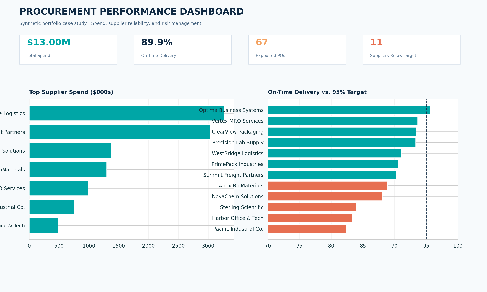
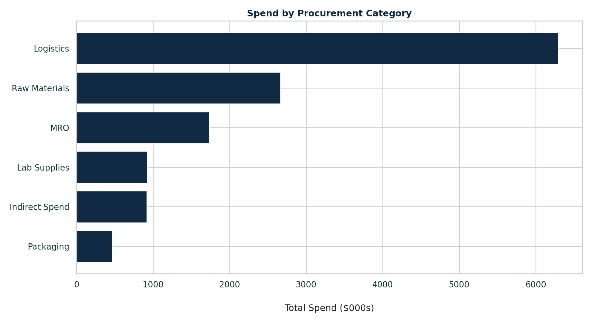
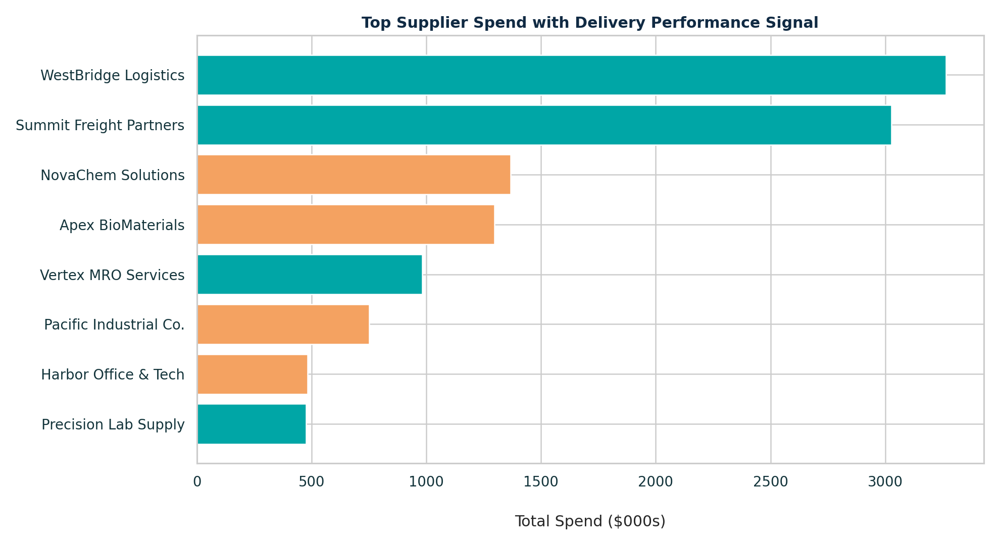
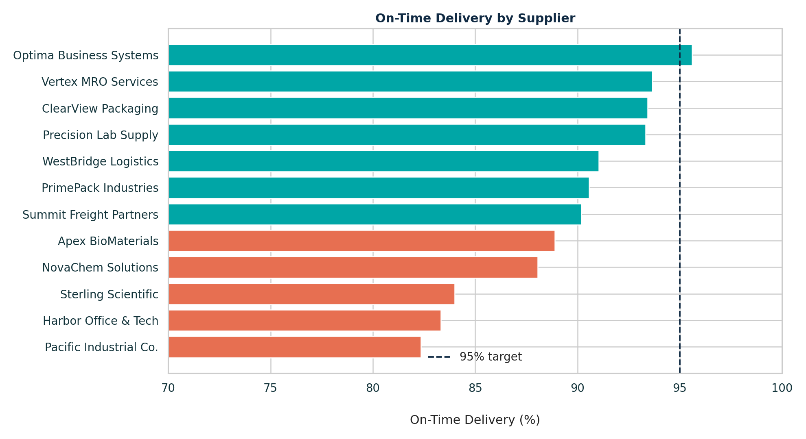

<h1 align="center">📊 Procurement Spend & Supplier Performance Analysis</h1>

<p align="center">
  <em>End-to-end analysis of procurement spend and supplier performance using synthetic data, Python, SQL, and business-focused KPIs.</em>
</p>

<p align="center">
  
  
  
  
  
</p>

<p align="center">
  
</p>

---

## 📌 Overview

This project simulates a real-world **procurement analytics engagement**: taking raw purchase-order-level
data and turning it into decision-ready insights on **spend concentration, category trends, and supplier
reliability**. It mirrors the type of work a buyer/planner or supply-chain analyst does when building a
supplier scorecard or spend-visibility dashboard for leadership.

The pipeline moves through three layers commonly found in industry analytics stacks:

| Layer | Tool | Purpose |
|---|---|---|
| **Data** | Synthetic procurement dataset | Purchase orders, suppliers, categories, delivery dates, costs |
| **Query** | SQL | Aggregate spend, compute KPIs, rank suppliers |
| **Analysis & Visualization** | Python (Pandas, Matplotlib) | Clean data, calculate metrics, generate charts and scorecards |

---

## 🗂️ Repository Structure

```
procurement-spend-supplier-analysis/
├── notebooks/
│   └── procurement_analysis.ipynb     # End-to-end exploratory analysis
├── src/
│   └── procurement_analysis.py        # Reusable analysis pipeline (script version)
├── sql/
│   └── procurement_kpi_analysis.sql   # Spend & KPI queries
├── outputs/
│   ├── category_spend_summary.csv     # Aggregated spend by category
│   └── supplier_scorecard.csv         # Supplier performance scorecard
├── category_spend.png                 # Spend by category chart
├── supplier_spend.png                 # Spend by supplier chart
├── on_time_delivery.png               # On-time delivery performance chart
├── dashboard_preview.png              # Combined dashboard preview
├── requirements.txt
└── README.md
```

---

## 🔑 Key Questions Answered

- Which **categories** and **suppliers** drive the majority of procurement spend?
- How concentrated is spend risk across the supply base (80/20 analysis)?
- Which suppliers are the **most/least reliable** on on-time delivery?
- How do cost, volume, and delivery performance combine into a single supplier scorecard?

---

## 📈 Visual Insights

<table>
<tr>
<td width="50%">

<p align="center"><sub><b>Spend by Category</b></sub></p>
</td>
<td width="50%">

<p align="center"><sub><b>Spend by Supplier</b></sub></p>
</td>
</tr>
<tr>
<td width="50%" colspan="2">

<p align="center"><sub><b>On-Time Delivery Performance by Supplier</b></sub></p>
</td>
</tr>
</table>

---

## ⚙️ How It Works

1. **Data prep** — Load and clean the raw procurement dataset (purchase orders, supplier IDs, categories,
   cost, order/delivery dates).
2. **SQL layer** (`sql/procurement_kpi_analysis.sql`) — Aggregate total and category-level spend, compute
   supplier-level KPIs such as on-time delivery rate and average order value.
3. **Python analysis** (`src/procurement_analysis.py`, `notebooks/procurement_analysis.ipynb`) — Reproduce
   and extend the SQL logic in Pandas, generate the supplier scorecard, and render the chart set (`.png`
   files) used in this README.
4. **Outputs** (`outputs/`) — Clean, reusable CSVs (`category_spend_summary.csv`, `supplier_scorecard.csv`)
   that can feed directly into a BI tool such as Power BI or Tableau.

---

## 🚀 Getting Started

```bash
# 1. Clone the repository
git clone https://github.com/JonathanMCopelandJr/procurement-spend-supplier-analysis.git
cd procurement-spend-supplier-analysis

# 2. Install dependencies
pip install -r requirements.txt

# 3. Run the analysis script
python src/procurement_analysis.py

# ...or explore interactively
jupyter notebook notebooks/procurement_analysis.ipynb
```

Query the KPI logic directly in SQL:

```bash
sql/procurement_kpi_analysis.sql
```

---

## 🧠 Skills Demonstrated

- Procurement & supply-chain KPI design (spend concentration, on-time delivery, supplier scorecards)
- SQL aggregation and window-function style ranking
- Python data wrangling with Pandas
- Data visualization with Matplotlib
- Translating raw transactional data into business-ready outputs

---

## 👤 Author

**Jonathan M. Copeland Jr.**
Buyer Planner · M.S. Data Analytics · SQL · Python · Excel · Forecasting · Supply Chain Analytics

[Portfolio](https://jonathanmcopelandjr.com/) · [GitHub](https://github.com/JonathanMCopelandJr)

---

<p align="center"><sub>Built as part of a hands-on supply-chain analytics portfolio project.</sub></p>
